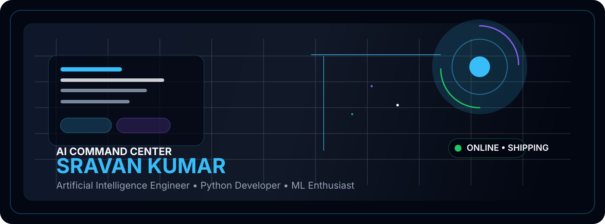
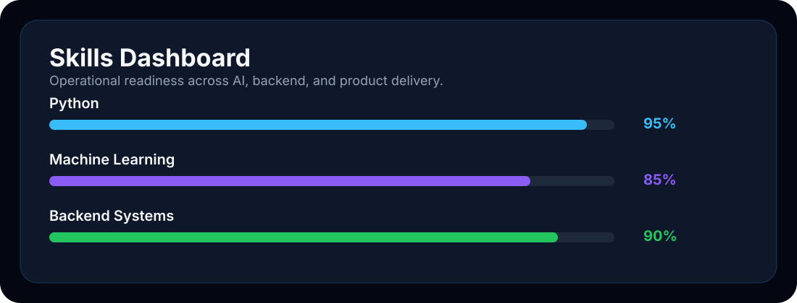
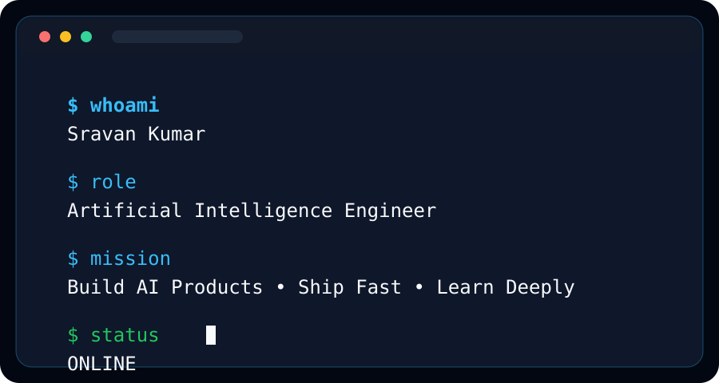
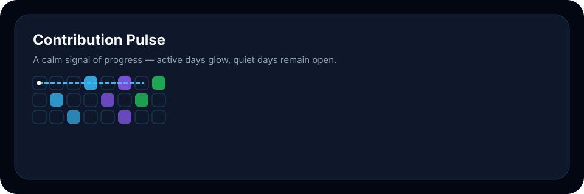
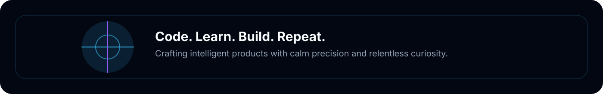

<div align="center">



<p>
  
  
  
</p>

<p align="center">
  
</p>

</div>


## 🛰 AI Mission Control

```text
SYSTEM STATUS        : ONLINE
MISSION              : Build Scalable AI Products
ROLE                 : Artificial Intelligence Engineer
PRIMARY STACK        : Python • FastAPI • Flask • ML • Deep Learning
DATABASE             : MongoDB • SQL
TOOLS                : Git • GitHub • Linux
CURRENT FOCUS        : Backend Systems • Intelligent Automation • Research
```

## 👨‍💻 About Me

```yaml
Name: Sravan Kumar
Role: AI Engineer | Python Developer | Backend Engineer
Focus: Machine Learning, Deep Learning, FastAPI, Data Systems
Education: B.Tech Artificial Intelligence & Data Science
Location: India
```

## ⚙️ Professional Tech Stack

<p align="center">
  
</p>

### Programming
Python • Java • SQL • Bash

### Backend
FastAPI • Flask • REST APIs • Microservices

### AI
Machine Learning • Deep Learning • NLP • Data Science

### Database
MongoDB • PostgreSQL • MySQL

### Dev Tools
Git • GitHub • VS Code • Linux

### Cloud
Docker • Deployment • CI/CD • Cloud-ready Architecture

## 📊 GitHub Analytics

<p align="center">
  
  
</p>

<p align="center">
  
</p>

<p align="center">
  
</p>

## 🚀 Featured Projects

<div align="center" style="display:flex; flex-wrap:wrap; gap:18px; justify-content:center;">
  <div style="width:320px; border:1px solid #38BDF8; border-radius:18px; padding:18px; background:#0F172A; text-align:left;">
    <h3 style="margin:0 0 8px; color:#F8FAFC;">Zyra</h3>
    <p style="margin:0 0 10px; color:#94A3B8;">AI interview platform with resume analysis, MCQ tests, and AI evaluation.</p>
    <p style="margin:0 0 8px; color:#38BDF8;">Stack: Python • FastAPI • ML</p>
    <p style="margin:0 0 12px; color:#22C55E;">Status: Active</p>
    <a href="https://github.com/sravankumar700" style="color:#F8FAFC;">GitHub</a> • <a href="#" style="color:#F8FAFC;">Demo</a>
  </div>
  <div style="width:320px; border:1px solid #8B5CF6; border-radius:18px; padding:18px; background:#0F172A; text-align:left;">
    <h3 style="margin:0 0 8px; color:#F8FAFC;">CodeRefine</h3>
    <p style="margin:0 0 10px; color:#94A3B8;">AI-powered code analysis and improvement platform.</p>
    <p style="margin:0 0 8px; color:#38BDF8;">Stack: Python • Flask • NLP</p>
    <p style="margin:0 0 12px; color:#22C55E;">Status: In Development</p>
    <a href="https://github.com/sravankumar700" style="color:#F8FAFC;">GitHub</a> • <a href="#" style="color:#F8FAFC;">Demo</a>
  </div>
  <div style="width:320px; border:1px solid #22C55E; border-radius:18px; padding:18px; background:#0F172A; text-align:left;">
    <h3 style="margin:0 0 8px; color:#F8FAFC;">Credit Card Fraud Detection</h3>
    <p style="margin:0 0 10px; color:#94A3B8;">Machine learning system for fraud detection and anomaly analysis.</p>
    <p style="margin:0 0 8px; color:#38BDF8;">Stack: Python • Scikit-learn</p>
    <p style="margin:0 0 12px; color:#22C55E;">Status: Research/Prototype</p>
    <a href="https://github.com/sravankumar700" style="color:#F8FAFC;">GitHub</a> • <a href="#" style="color:#F8FAFC;">Demo</a>
  </div>
  <div style="width:320px; border:1px solid #38BDF8; border-radius:18px; padding:18px; background:#0F172A; text-align:left;">
    <h3 style="margin:0 0 8px; color:#F8FAFC;">Apache Kafka Experiments</h3>
    <p style="margin:0 0 10px; color:#94A3B8;">Event streaming, real-time producers, consumers, and processing experiments.</p>
    <p style="margin:0 0 8px; color:#38BDF8;">Stack: Python • Kafka • Streaming</p>
    <p style="margin:0 0 12px; color:#22C55E;">Status: Experimental</p>
    <a href="https://github.com/sravankumar700" style="color:#F8FAFC;">GitHub</a> • <a href="#" style="color:#F8FAFC;">Demo</a>
  </div>
</div>

## 🧠 Skills Dashboard

<p align="center">
  
</p>

## 💻 Developer Terminal

<p align="center">
  
</p>

## 🧭 Learning Journey

<p align="center">
  
</p>

## 🏅 Achievements

- Built AI-driven systems with practical product focus
- Delivered end-to-end backend and ML workflows
- Focused on real-world engineering and deployment readiness
- Committed to consistent growth and strong fundamentals

## 🎓 Certifications

- Python Programming
- Machine Learning Foundations
- Backend Development with FastAPI
- Data Science and AI Practice

## 🎯 Current Goals

- Build impactful AI products
- Strengthen backend architecture and APIs
- Master scalable deployment workflows
- Contribute to open source and collaborative engineering

## 🌐 Connect With Me

<p align="center">
  <a href="https://github.com/sravankumar700">
    
  </a>
  <a href="https://www.linkedin.com/">
    
  </a>
  <a href="mailto:sravankumar700@gmail.com">
    
  </a>
  <a href="https://sravankumar700.github.io/">
    
  </a>
</p>

## 🐍 Contribution Pulse

<p align="center">
  
</p>


