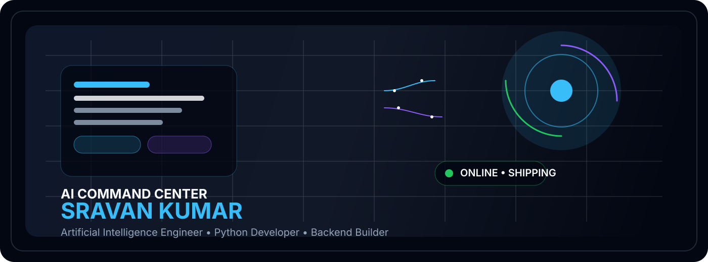
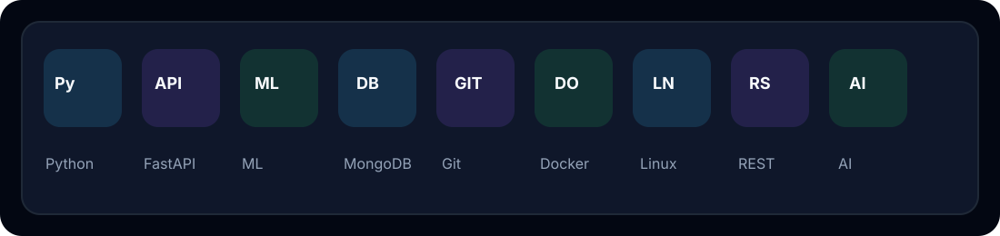
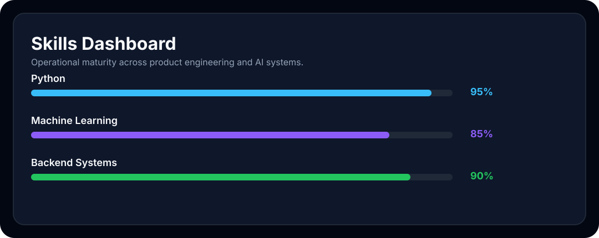
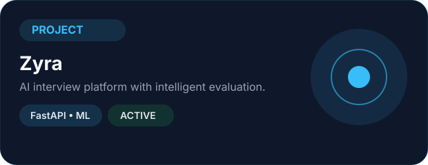
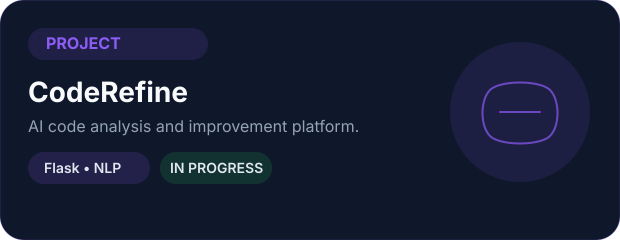
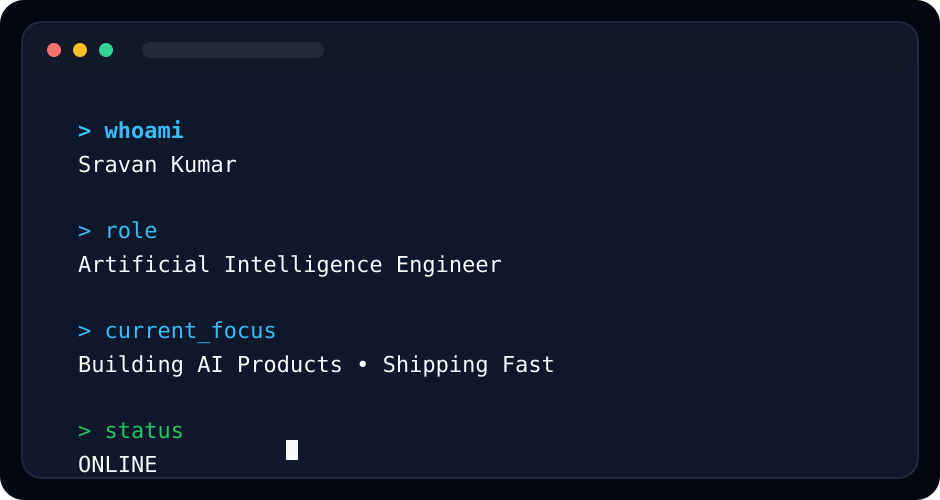
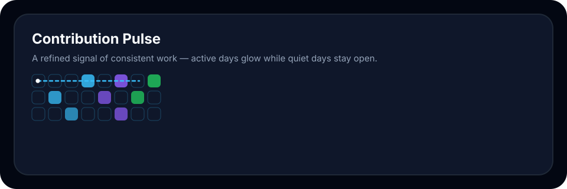
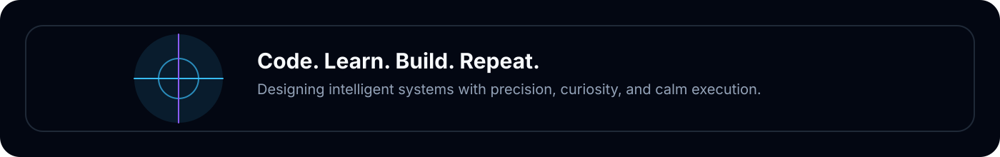

<div align="center">



<p align="center">
  
  
  
</p>

<p align="center">
  
</p>

</div>


## 🛰 Mission Control

<div align="center">
  
</div>

```text
SYSTEM STATUS       : ONLINE
CURRENT MISSION     : Building intelligent software that solves real-world problems
CURRENT FOCUS       : Backend Engineering • Machine Learning • FastAPI
PRIMARY STACK       : Python • FastAPI • Flask • MongoDB • PostgreSQL
TOOLS               : Git • GitHub • Linux • Docker
LOCATION            : India
```

## 👨‍💻 About Me

```yaml
Name: Sravan Kumar
Title: Artificial Intelligence Engineer
Education: B.Tech Artificial Intelligence & Data Science
Focus: Python, Backend Systems, Machine Learning, Deep Learning
Location: India
```

## ⚙️ Professional Tech Stack

<p align="center">
  
</p>

<p align="center">
  
</p>

## 📊 GitHub Analytics

<p align="center">
  
  
</p>

<p align="center">
  
</p>

<p align="center">
  
  
  
</p>

## 🚀 Featured Projects

<div align="center" style="display:flex; flex-wrap:wrap; gap:18px; justify-content:center;">
  <div style="width:48%; min-width:320px; border:1px solid #1F2937; border-radius:20px; padding:14px; background:#0F172A; text-align:left;">
    
    <div style="margin-top:10px;">
      <p style="margin:0 0 6px; color:#F8FAFC; font-weight:700;">Zyra</p>
      <p style="margin:0 0 8px; color:#94A3B8;">AI interview platform with intelligent evaluation workflows.</p>
      <p style="margin:0 0 8px; color:#38BDF8;">Python • FastAPI • ML</p>
      <p style="margin:0 0 10px; color:#22C55E;">Status: Active</p>
      <a href="https://github.com/sravankumar700" style="color:#F8FAFC;">GitHub</a> • <a href="https://sravankumar700.github.io/" style="color:#F8FAFC;">Live</a>
    </div>
  </div>
  <div style="width:48%; min-width:320px; border:1px solid #1F2937; border-radius:20px; padding:14px; background:#0F172A; text-align:left;">
    
    <div style="margin-top:10px;">
      <p style="margin:0 0 6px; color:#F8FAFC; font-weight:700;">CodeRefine</p>
      <p style="margin:0 0 8px; color:#94A3B8;">AI-powered code analysis and improvement platform.</p>
      <p style="margin:0 0 8px; color:#8B5CF6;">Flask • NLP • Backend</p>
      <p style="margin:0 0 10px; color:#22C55E;">Status: In Progress</p>
      <a href="https://github.com/sravankumar700" style="color:#F8FAFC;">GitHub</a> • <a href="https://sravankumar700.github.io/" style="color:#F8FAFC;">Live</a>
    </div>
  </div>
</div>

## 💻 Developer Terminal

<p align="center">
  
</p>

## 🧭 Learning Journey

<p align="center">
  
</p>

## 🏅 Achievements

- Built production-minded AI systems with strong backend foundations
- Delivered practical machine learning and data-driven solutions
- Focused on clean architecture, reliability, and continuous learning
- Built a strong foundation across Python, APIs, and modern tooling

## 🎓 Certifications

- Python Programming
- Machine Learning Foundations
- FastAPI & Backend Development
- Data Science & AI Practice

## 🎯 Current Goals

- Build impactful AI products
- Master scalable backend architecture
- Strengthen Docker and deployment workflows
- Contribute to open source and collaborative engineering

## 🌐 Connect

<p align="center">
  <a href="https://github.com/sravankumar700">
    
  </a>
  <a href="https://www.linkedin.com/">
    
  </a>
  <a href="mailto:sravankumar700@gmail.com">
    
  </a>
  <a href="mailto:sravankumar700@gmail.com?subject=Resume%20Request">
    
  </a>
</p>

## 🐍 Contribution Snake

<p align="center">
  
</p>


